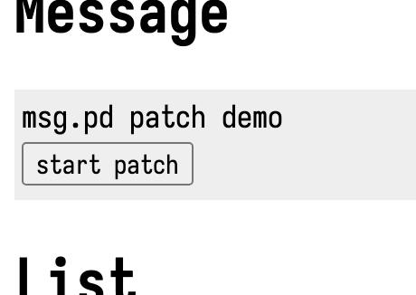
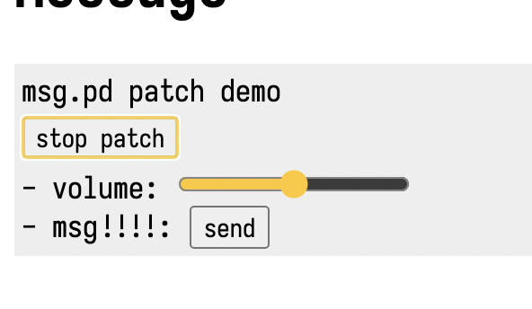

[back to index](./index.md)

# tutorial_0

Welcome to mdpd (Extending Markdown to Embed Pure Data Programs)

## Trying a Pure Data Patch

You can play a Pure Data patch within Markdown.

Here's how:

### 1. Start the Patch

By clicking the 'Start Patch' button, you can activate the patch.

### 2. Change Volume

By adjusting the volume slider, you can control the volume.

### 3. Enjoy the Sound

By changing the input, you can enjoy the music.

## Next

[tutorial_1](./tutorial_1.md)
